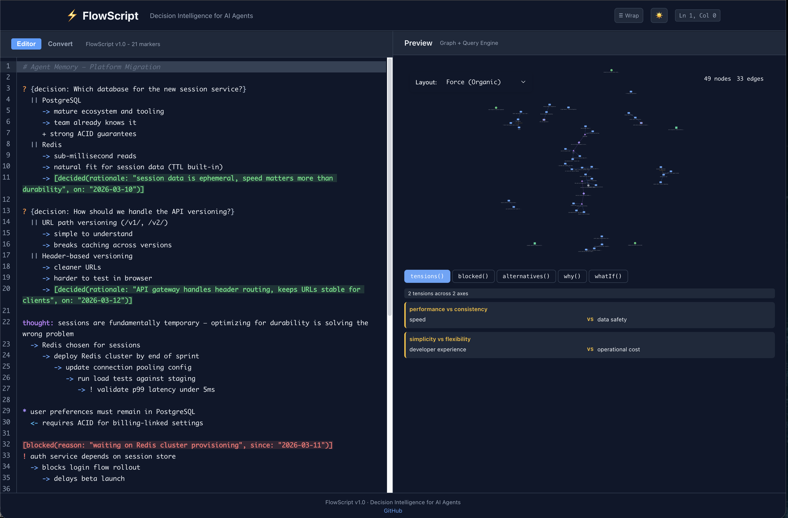

<p align="center">
  
</p>

<h1 align="center">flowscript-agents</h1>

<p align="center"><strong>Your AI agents make decisions they can't explain. FlowScript makes those decisions queryable.</strong></p>

<p align="center">Drop-in adapters for 9 agent frameworks. Plain text in, typed reasoning queries out.<br>Hash-chained audit trail. Convergence certificates. CloudClient for independent witnessing. MIT licensed.</p>

<p align="center"><em>EU AI Act enforcement begins August 2026. Audit trails can't be backdated.<br>FlowScript is the compliance engine that makes your agents audit-ready from day one.</em></p>

[](https://github.com/phillipclapham/flowscript-agents) [](https://pypi.org/project/flowscript-agents/) [](LICENSE) [](https://pypi.org/project/flowscript-agents/)

---

```python
from openai import OpenAI
from flowscript_agents import UnifiedMemory
from flowscript_agents.embeddings import OpenAIEmbeddings

client = OpenAI()
llm = lambda prompt: (client.chat.completions.create(
    model="gpt-4o-mini", messages=[{"role": "user", "content": prompt}]
).choices[0].message.content or "")

with UnifiedMemory("agent-memory.json", embedder=OpenAIEmbeddings(), llm=llm) as mem:
    mem.add("Redis gives sub-ms reads which is critical for our UX requirements")
    mem.add("Redis clustering costs $200/month which exceeds our infrastructure budget of $50/month")
    mem.add("PostgreSQL gives us rich queries at $15/month but read latency is 10-50ms")

    tensions = mem.memory.query.tensions()
    # → The LLM detected the $200/month vs $50/month contradiction
    # → and preserved both sides as a queryable tension — not a deletion

    # Pick any node to trace its reasoning:
    first_node = mem.memory.nodes[0]
    why = mem.memory.query.why(first_node.id)
    # → Full causal chain backward from any decision

    blocked = mem.memory.query.blocked()
    # → What's stuck + downstream impact
```

Five queries that no vector store can answer — `why()`, `tensions()`, `blocked()`, `alternatives()`, `whatIf()` — over a typed reasoning graph. Drop-in adapters for [9 agent frameworks](#works-with-your-stack). Hash-chained audit trail. And when memories contradict, we don't delete — we create a queryable *tension*.

<p align="center">
  
</p>

---

## Why FlowScript

Every agent framework gives AI agents memory. None of them make that memory queryable.

Vector stores retrieve content that looks similar. That's useful, but it's not reasoning. When an auditor asks "why did your agent deny that claim?" or a developer asks "what breaks if we change this decision?" — similarity search returns a guess. FlowScript returns the actual typed reasoning chain.

This is the gap researchers call "[strategic blindness](https://arxiv.org/abs/2603.18718)" — memory that tracks content without tracking reasoning. FlowScript sits above your memory store, not instead of it. Mem0, LangGraph checkpointers, Google Memory Bank — they remember what your agent stored. FlowScript remembers *why it decided*, what it traded off, and what breaks if you change your mind.

---

## Get Started

### MCP Server (Claude Code / Cursor — zero code)

```bash
pip install flowscript-agents openai
```

The `openai` package is required for extraction, consolidation, and vector search. Without it, `add_memory` stores raw text and `query_tensions` won't find anything.

Add to your editor's MCP config:

**Claude Code** — add to `.claude/settings.json` in your project (or `~/.claude/settings.json` for global):

```json
{
  "mcpServers": {
    "flowscript": {
      "command": "flowscript-mcp",
      "args": ["--memory", "./project-memory.json"],
      "env": {
        "OPENAI_API_KEY": "your-key"
      }
    }
  }
}
```

**Cursor / Windsurf / VS Code** — add to `.mcp.json` in your project root:

```json
{
  "mcpServers": {
    "flowscript": {
      "type": "stdio",
      "command": "flowscript-mcp",
      "args": ["--memory", "./project-memory.json"],
      "env": {
        "OPENAI_API_KEY": "your-key"
      }
    }
  }
}
```

**Fallback:** If `env` passthrough doesn't work in your editor, export the key in your shell before launching:
```bash
export OPENAI_API_KEY=your-key
```

The server auto-detects your API key and configures the full stack:

| Key | What you get |
|:----|:-------------|
| `OPENAI_API_KEY` | Vector search (text-embedding-3-small) + typed extraction (gpt-4o-mini) + consolidation |
| `ANTHROPIC_API_KEY` | Typed extraction + consolidation (no embeddings, keyword search fallback) |
| Neither | Raw text storage only. Tools work, but no typed extraction and `query_tensions` won't find anything. |

**Without an API key, you get a degraded experience.** The server warns on startup and in tool responses.

### Embedding Providers

The default is OpenAI `text-embedding-3-small`. To use a different provider, pass flags in `args`:

```json
"args": ["--memory", "./project-memory.json", "--embedder", "ollama", "--embedding-model", "nomic-embed-text"]
```

| Flag | What it does | Default |
|:-----|:-------------|:--------|
| `--embedder` | Embedding provider: `openai`, `sentence-transformers`, or `ollama` | Auto-detected from API key |
| `--embedding-model` | Model name (provider-specific) | `text-embedding-3-small` (OpenAI) |
| `--llm-model` | LLM for extraction and consolidation | `gpt-4o-mini` |
| `--no-auto` | Disable auto-configuration from API keys | Off |

**Local embeddings (free, no API key for embeddings):**

| Provider | Install | Example model | Notes |
|:---------|:--------|:--------------|:------|
| Ollama | [Install Ollama](https://ollama.com), then `ollama pull nomic-embed-text` | `nomic-embed-text` | Beats text-embedding-3-small. 274MB. |
| SentenceTransformers | `pip install sentence-transformers` | `BAAI/bge-m3` | Runs on CPU. Downloads on first use. |

You still need an LLM API key (`OPENAI_API_KEY` or `ANTHROPIC_API_KEY`) for typed extraction and consolidation, even when using local embeddings.

**Using Anthropic instead of OpenAI:**

With `ANTHROPIC_API_KEY` set, the server auto-configures extraction and consolidation using Claude Haiku. No vector search (Anthropic has no embedding API), but keyword + temporal search works well. To use a different Anthropic model:

```json
"args": ["--memory", "./project-memory.json", "--llm-model", "claude-sonnet-4-6"]
```

**Then add the [CLAUDE.md snippet](examples/CLAUDE.md.example) to your project.** This is what turns tools into a workflow. It tells your agent *when* to record decisions, surface tensions before new choices, and check blockers at session start. Without it, the tools are available but passive. With it, your agent proactively tracks your project's reasoning.

### Python SDK

```bash
pip install flowscript-agents                       # Core
pip install flowscript-agents[langgraph]            # + LangGraph adapter
pip install flowscript-agents[crewai]               # + CrewAI adapter
pip install flowscript-agents[all]                  # Everything (9 frameworks)
```

Bracket syntax matters — it installs framework-specific dependencies.

---

## How It Works

FlowScript operates at three levels. Pick where you start:

**Level 1 — Reasoning graph, no API keys.** Use the `Memory` class directly to build typed nodes (thoughts, questions, decisions) with explicit relationships (causes, tensions, alternatives). Sub-ms queries, zero external deps. This is the power-user API. [Full docs →](docs/api-reference.md)

**Level 2 — Add vector search.** Pass an `embedder` to `UnifiedMemory` for semantic similarity search alongside reasoning queries. Three providers: OpenAI, SentenceTransformers, Ollama. [Details →](docs/api-reference.md#unifiedmemory)

**Level 3 — Full stack.** Add an `llm` for auto-extraction (plain text → typed nodes) and a `consolidation_provider` for contradiction handling. Or just use the MCP server, which auto-configures all of this from a single API key.

---

## First 5 Minutes

With the MCP server running and the CLAUDE.md snippet in your project, try this conversation:

> "I need to decide between PostgreSQL and MongoDB for our user data. We need ACID compliance for payments but flexibility for user profiles."

Your agent stores the decision context, tradeoffs, and rationale automatically. Now introduce contradictory information:

> "Actually, I've been looking at DynamoDB. The scale requirements might matter more than I thought."

Now ask:

> "What tensions do we have in our architecture decisions?"

FlowScript preserved both perspectives (PostgreSQL's ACID compliance vs DynamoDB's scalability) as a queryable tension instead of deleting the first decision. That's what **RELATE > DELETE** means in practice.

After a few sessions, try:
- *"What's blocking our progress?"* surfaces blockers and their downstream impact
- *"Why did we choose PostgreSQL originally?"* traces the full causal chain
- *"What if we switch to DynamoDB?"* maps the downstream consequences

After 20 sessions, you have a curated knowledge base of your project's decisions, not a pile of notes. Knowledge that stays relevant graduates through temporal tiers. One-off observations fade naturally.

---

## Works With Your Stack

Drop-in adapters that implement your framework's native interface. Same API you already use — plus `query.tensions()`.

```python
from flowscript_agents.langgraph import FlowScriptStore

with FlowScriptStore("agent-memory.json") as store:
    # Standard LangGraph BaseStore operations
    store.put(("agents", "planner"), "db_decision", {"value": "chose Redis for speed"})
    items = store.search(("agents", "planner"), query="Redis")

    # What's new — typed reasoning queries on the same data
    tensions = store.memory.query.tensions()
    blockers = store.memory.query.blocked()

    # Resolve a store key to its full reasoning context
    node = store.resolve(("agents", "planner"), "db_decision")
```

| Framework | Adapter | Install |
|:----------|:--------|:--------|
| **LangGraph** | `FlowScriptStore` → `BaseStore` | `[langgraph]` |
| **CrewAI** | `FlowScriptStorage` → `StorageBackend` | `[crewai]` |
| **Google ADK** | `FlowScriptMemoryService` → `BaseMemoryService` | `[google-adk]` |
| **OpenAI Agents** | `FlowScriptSession` → `Session` | `[openai-agents]` |
| **Pydantic AI** | `FlowScriptDeps` → Deps + tools | `[pydantic-ai]` |
| **smolagents** | `FlowScriptMemory` → Tool protocol | `[smolagents]` |
| **LlamaIndex** | `FlowScriptMemoryBlock` → `BaseMemoryBlock` | `[llamaindex]` |
| **Haystack** | `FlowScriptMemoryStore` → `MemoryStore` | `[haystack]` |
| **CAMEL-AI** | `FlowScriptCamelMemory` → `AgentMemory` | `[camel-ai]` |

All adapters expose `.memory` for query access, support `with` blocks, and accept optional `embedder`/`llm`/`consolidation_provider` for vector search and extraction. [Per-framework examples →](docs/adapters.md)

---

## When Memories Contradict

Every other memory system handles contradictions by deleting. Mem0's consolidation uses ADD/UPDATE/DELETE/NONE — when facts contradict, the old memory is replaced. LangGraph's langmem does the same. CrewAI's consolidation is flat keep/update/delete.

FlowScript doesn't delete. It **relates**.

When consolidation detects a contradiction, it creates a `RELATE` — a tension with a named axis. Both memories survive. The disagreement itself becomes queryable knowledge.

| Action | What happens |
|:-------|:-------------|
| `ADD` | New knowledge, no existing match |
| `UPDATE` | Enriches existing node with new detail |
| `RELATE` | Contradiction detected — both sides preserved as a queryable tension |
| `RESOLVE` | Blocker condition changed — downstream decisions unblocked |
| `SKIP` | Exact duplicate, no action |

You can't audit a deletion. You can query a tension.

---

## Audit Trail

Every mutation is SHA-256 hash-chained, append-only, crash-safe. Verify the full chain in one call:

```python
from flowscript_agents import Memory, MemoryOptions, AuditConfig

mem = Memory.load_or_create("agent.json",
    options=MemoryOptions(audit=AuditConfig(retention_months=84)))

# ... agent does work ...

result = Memory.verify_audit("agent.audit.jsonl")
# → AuditVerifyResult(valid=True, total_entries=42, files_verified=1)
```

Framework attribution is automatic — every audit entry records which adapter triggered it. Query by time range, event type, adapter, or session. Rotation with gzip compression.

**SIEM integration:** `on_event` callback fires for every audit entry. Use `on_event_async=True` for non-blocking dispatch — slow webhooks won't block agent operations:

```python
from flowscript_agents import Memory, MemoryOptions, AuditConfig

def send_to_siem(entry):
    requests.post("https://siem.example.com/ingest", json=entry)

mem = Memory.load_or_create("agent.json", options=MemoryOptions(
    audit=AuditConfig(on_event=send_to_siem, on_event_async=True)
))
```

Events are dispatched in order (single worker thread). Callback failures log to stderr but never block audit writes. Call `writer.close()` for graceful shutdown of in-flight callbacks.

---

## @fix — Convergence Certificates

When FlowScript's consolidation engine resolves contradictions — creating tensions, updating beliefs, unblocking decisions — it produces **convergence certificates**: hash-chained attestations that prove how the reasoning graph changed and that the transformation hasn't been tampered with.

```python
from flowscript_agents import Memory, MemoryOptions, AuditConfig

mem = Memory.load_or_create("agent.json", options=MemoryOptions(
    audit=AuditConfig(retention_months=84)
))

# UnifiedMemory consolidation produces certificates automatically:
# initial_graph_hash → delta_sequence → final_graph_hash → certificate_hash
```

Each certificate records: the graph state before consolidation (`initial_hash`), what changed (`delta_sequence`), the graph state after (`final_hash`), and a hash proving the record is tamper-evident (`certificate_hash`). This is concrete Article 86 infrastructure — an auditor can verify not just what your agent decided, but how it got there.

**Underlying formal model:** FlowScript's `@fix` operator provides stratified fixpoint computation over typed reasoning graphs — L0 (pure description, always terminates), L1 (bounded fixpoint, Knaster-Tarski guarantees), L2 (general fixpoint, Turing-complete, bounded). Consolidation is a degenerate L1 fixpoint (single iteration). Full spec: [`fixpoint_spec.md`](https://github.com/phillipclapham/flowscript/blob/main/spec/fixpoint_spec.md).

---

## FlowScript Cloud — Independent Cryptographic Witnessing *(Coming Soon)*

Local audit trails are tamper-evident but self-attested. FlowScript Cloud will add independent verification: your SDK streams events to the Cloud service, which verifies chain continuity and stores witness attestations.

The CloudClient is included in the SDK and ready for integration. The Cloud service is under development.

```python
from flowscript_agents import Memory, MemoryOptions, AuditConfig
from flowscript_agents.cloud import CloudClient

cloud = CloudClient()  # reads FLOWSCRIPT_API_KEY from env

mem = Memory.load_or_create("agent.json", options=MemoryOptions(
    audit=AuditConfig(on_event=cloud.queue_event)
))
```

**CloudClient features:**
- **Batch buffering** — events accumulate and flush in batches (configurable `batch_size`, default 50)
- **Lock-free I/O** — network operations never block your agent's main thread
- **Buffer overflow protection** — `max_buffer_size` cap prevents memory growth
- **Witness tracking** — `cloud.last_witness` returns the most recent attestation
- **Retry with backoff** — transient failures retry automatically

**Planned deployment tiers:** SaaS, self-hosted Cloudflare, or Docker on-premise. BSL 1.1 licensed.

---

## Session Lifecycle — How Memory Gets Smarter

Just like a mind needs sleep to consolidate memories, your agent's reasoning graph needs regular session wraps to develop intelligence over time. Without consolidation cycles, knowledge accumulates as noise instead of maturing.

**Temporal tiers** — nodes graduate based on actual use:

| Tier | Meaning | Behavior |
|:-----|:--------|:---------|
| `current` | Recent observations | May be pruned if not reinforced |
| `developing` | Emerging patterns (2+ touches) | Building confidence |
| `proven` | Validated through use (3+ touches) | Protected from pruning |
| `foundation` | Core truths | Always preserved |

Every query touches returned nodes — knowledge that keeps getting queried earns its place. One-off observations fade naturally. Dormant nodes are pruned to the audit trail — archived with full provenance, never destroyed.

**Three ways session wraps happen:**

1. **Explicit** — the LLM calls the `session_wrap` tool when you say "let's wrap up" (best results)
2. **Auto-wrap** — after 5 minutes of inactivity, the MCP server auto-consolidates (safety net, configurable via `FLOWSCRIPT_AUTO_WRAP_MINUTES`, set to `0` to disable)
3. **Process exit** — when the MCP server shuts down, a final consolidation runs automatically

**For SDK users** — adapters support context managers that auto-wrap:

```python
from flowscript_agents.langgraph import FlowScriptStore

with FlowScriptStore("agent-memory.json") as store:
    # work happens — all mutations auto-save
    store.put(("agents",), "key", {"value": "data"})
# close() fires automatically → session_wrap() + save
```

After 20 sessions, your memory is a curated knowledge base, not a pile of notes. [Full lifecycle details →](docs/lifecycle.md)

---

## Description Integrity

MCP tool descriptions are the prompts your LLM reads. If they're mutated in-process, the LLM silently follows poisoned instructions. The FlowScript MCP server includes three-layer integrity verification — a reference implementation of [deterministic description integrity for MCP](https://github.com/modelcontextprotocol/modelcontextprotocol/discussions/2402):

1. **`verify_integrity` tool** — LLM-callable. SHA-256 hashes of all tool definitions, deep-frozen at startup (`MappingProxyType`). Detects in-process mutation by malicious dependencies, monkey-patching, or middleware.
2. **`flowscript://integrity/manifest` resource** — Host-verifiable. Claude Code / Cursor can verify descriptions without LLM involvement.
3. **`tool-integrity.json`** — Build-time root of trust. Generated via `flowscript-mcp --generate-manifest`, ships in the package.

Both the Python and [TypeScript](https://www.npmjs.com/package/flowscript-core) MCP servers implement this architecture. Honest threat model: detects in-process mutation, not supply chain or transport-layer attacks. [Full discussion →](https://github.com/modelcontextprotocol/modelcontextprotocol/discussions/2402)

---

## Comparison

Every agent framework gives AI agents memory. None make that memory auditable, typed, or queryable at the reasoning level. That's the layer FlowScript occupies.

| | FlowScript | Mem0 | Vector stores |
|:---|:---|:---|:---|
| Find similar content | Vector search | Vector search | Vector search |
| "Why did we decide X?" | `why()` — typed causal chain | — | — |
| "What's blocking?" | `blocked()` — downstream impact | — | — |
| "What tradeoffs?" | `tensions()` — named axes | — | — |
| "What if we change this?" | `whatIf()` — impact analysis | — | — |
| Contradictions | `RELATE` — both sides preserved | `DELETE` — replaced | N/A |
| Audit trail | SHA-256 hash chain | — | — |
| Temporal graduation | Automatic 4-tier | — | — |
| Token budgeting | 4 strategies | — | — |

Under the hood: a local semantic graph with typed nodes, typed relationships, and typed states. Queries traverse structure — no embeddings required, no LLM calls, no network. Sub-ms on project-scale graphs.

Vector search and reasoning queries are orthogonal — use both. Mem0 for retrieval, FlowScript for reasoning. They're different architectural layers.

---

## Enterprise & Compliance

FlowScript's typed reasoning chains are also compliance-ready audit infrastructure. This isn't a separate product — it's a structural property of how FlowScript works.

**EU AI Act coverage:**

| Requirement | Article | How FlowScript satisfies it |
|:---|:---|:---|
| Record-keeping | Art. 12 | Hash-chained audit trail, append-only, tamper-evident, 7yr default retention |
| Transparency | Art. 13 | `why()` queries return typed causal chains — not reconstructions, actual reasoning records |
| Right to explanation | Art. 86 | `explain()` generates deterministic, reproducible compliance documents from `why()` results |
| Monitoring | Art. 72 | `on_event` / `on_event_async` callbacks stream audit events to SIEM/monitoring systems |

**Article 86 — Right to Explanation:**

```python
from flowscript_agents import Memory, explain

mem = Memory.load_or_create("agent.json")
# ... agent builds reasoning graph during normal work ...

result = mem.query.why(decision_node.id)
print(explain(result, subject="Applicant ID #4821", audience="legal"))
```

```
AUTOMATED DECISION EXPLANATION
Issued under EU AI Act Article 86 (Right to Explanation)

Subject: Applicant ID #4821
Decision: loan application denied
Causal chain depth: 3 steps

CAUSAL SEQUENCE
  Step 1 (foundational factor): applicant income below minimum requirement
  Step 2 (derives from): debt-to-income ratio exceeds policy limit
  Step 3 (derives from): risk assessment: HIGH
  Outcome: loan application denied

CERTIFICATION
Generated: 2026-03-27T19:46:46Z
This explanation is generated from a deterministic causal reasoning graph
maintained by FlowScript. The complete hash-chained audit trail is available
upon request and can be verified against the original reasoning record.
```

Three audience modes: `"general"` (plain English for affected individuals), `"legal"` (formal compliance language with Article 86 citation and hash-chain reference), `"technical"` (structured debug output). No LLM in the loop — the explanation is deterministic and reproducible.

**Via MCP:** call the `explain_decision` tool with a node ID or content search. Same deterministic output, accessible from Claude Code, Cursor, or any MCP client.

**Via framework adapters:** access the underlying Memory through `adapter.memory`:

```python
from flowscript_agents import explain
result = adapter.memory.query.why(node_id)
text = explain(result, audience="legal")
```

**Enforcement begins August 2026.** Audit trails can't be backdated. Organizations using FlowScript today have unbroken reasoning records from day one. You can turn on logging tomorrow — you can't manufacture the last 18 months of decision provenance.

**Architecture:**

```
┌─────────────────────────────────────────────────────┐
│  Your Agent Framework (LangGraph, CrewAI, ADK, ...) │
├─────────────────────────────────────────────────────┤
│  FlowScript SDK — Typed Reasoning Layer             │
│  ┌──────────┐ ┌──────────┐ ┌──────────────────────┐ │
│  │  Memory   │ │ Queries  │ │ Audit Trail          │ │
│  │  (graph)  │ │ (5 ops)  │ │ (SHA-256 hash chain) │ │
│  │  @fix     │ │explain() │ │  on_event_async ─────────→ FlowScript Cloud
│  └──────────┘ └──────────┘ └──────────────────────┘ │  (independent witness)
├─────────────────────────────────────────────────────┤
│  Your Storage (files, database, cloud)              │
└─────────────────────────────────────────────────────┘
```

FlowScript doesn't replace your stack. It sits between your agent framework and your storage, adding typed reasoning and audit to whatever you already use. Optionally stream audit events to FlowScript Cloud *(coming soon)* for independent cryptographic witnessing.

---

## Security

Three independent CVE clusters dropped in the same week — MCPwned (SSRF via MCP trust boundaries), ClawHub (1,100+ malicious skills in agent marketplaces), and ClawJacked (CVE-2026-25253, CVSS 8.8, 15,200 affected instances). All share the same structural root cause: **unvalidated content flowing through agent invocation paths.**

You can't patch this at the application layer. The invocation path itself is untyped.

FlowScript's typed intermediate representation doesn't prevent every attack class — SSRF and transport-layer poisoning need different tools. What it makes structurally impossible is the deeper problem: **reasoning corruption.** Untraceable decisions, silent contradictions, unaudited state changes — these can't exist in a well-typed FlowScript graph. The type system makes them unrepresentable.

This is the same architectural insight behind [CHERI](https://www.cl.cam.ac.uk/research/security/ctsrd/cheri/): Cambridge proved that making unsafe states hardware-inexpressible eliminates 70% of memory-safety CVEs — structural prevention beats behavioral detection. FlowScript applies this insight at the cognitive layer. The enforcement boundary is different (SDK type system vs. hardware capabilities), but the principle is identical: make the violation unrepresentable rather than hoping to catch it after the fact.

---

## What FlowScript Actually Is

If you've read this far, you're ready for the deeper structure.

The five queries and the audit trail are what FlowScript *does*. Here's what it *is*, and why it matters beyond any single application.

**Musical notation didn't record what musicians were already playing.** Before staff notation, European music was monophonic — single melodies, loosely coordinated. Notation made polyphony possible. Bach's fugues are literally unthinkable without it — not "hard to remember," but impossible to *compose*, because the simultaneous interaction of independent voices requires a representational system precise enough to reason about counterpoint.

Notation expanded the space of possible musical thought.

**FlowScript does the same thing for AI cognition.** It doesn't record what agents are already thinking. It makes a new category of AI reasoning possible — the kind where you can have multiple reasoning chains interacting, where you can query across causal paths, where contradictions become structured tensions instead of silent overwrites. This category of reasoning is impossible in the vector-search paradigm because vector search has no representation for *why*.

**FlowScript's type system makes malformed reasoning unrepresentable.** Every decision traces to a question through alternatives. Every contradiction becomes a typed tension with a named axis. Every state change gets an audited reason. These constraints give FlowScript a property familiar from [type theory](https://en.wikipedia.org/wiki/Type_theory): well-typedness implies safety. A well-formed FlowScript graph can always be queried — no stuck states, no silent contradictions, no untraceable decisions. The type structure doesn't constitute formal proofs in the Curry-Howard sense, but it does what good type systems do: make certain classes of malformed state structurally unrepresentable.

**Compression reveals structure that verbosity hides.** When you force AI reasoning through typed encoding, you force the extraction of structure that would otherwise remain implicit in natural language. This maps to a deep result in information theory: the minimum description of a dataset *is* its structure. Optimal compression and genuine understanding are the same operation. FlowScript's temporal tiers — where knowledge graduates from observation to principle through use — implement this: each compression cycle distills signal from noise, and the resulting structure is *more useful* than the verbose original.

**The metacognitive loop.** When an AI agent writes FlowScript, queries its own reasoning graph, discovers tensions or gaps, and generates new reasoning informed by that structure — it's not just remembering. It's *reasoning about its own reasoning* through a typed, queryable substrate. This is metacognition, and it's the category of thought that FlowScript makes possible that no vector store can touch.

**This isn't just good engineering — there's math behind it.** [Recent work in formal epistemology](https://arxiv.org/abs/2603.17244) applied AGM belief revision postulates — the mathematical framework for rational belief change — and proved that deletion violates core rationality requirements. When you delete a contradicted memory, you destroy information that the formal framework says a rational agent must preserve. FlowScript's RELATE > DELETE approach satisfies these postulates: preserve contradictions as tensions, maintain provenance chains, never destroy reasoning history. The formal result says deletion is irrational. FlowScript is the implementation that takes that seriously.

**FlowScript is infrastructure.** Not a tool. Not a framework. Not a compliance product. Infrastructure — like SQL gave us queryable data, TCP/IP gave us addressable communication, and Git gave us trackable changes. FlowScript gives AI agents queryable reasoning. Everything else — compliance, security, memory, observability — is an application of that infrastructure.

The applications are what you install FlowScript for. The infrastructure is why it matters.

---

## Ecosystem

| Package | What | Install |
|:--------|:-----|:--------|
| [flowscript-agents](https://pypi.org/project/flowscript-agents/) | Python SDK — 9 adapters, CloudClient, unified memory, consolidation, audit trail | `pip install flowscript-agents openai` |
| [flowscript-core](https://www.npmjs.com/package/flowscript-core) | TypeScript SDK — Memory class, 15 tools, token budgeting, audit trail | `npm install flowscript-core` |
| [flowscript-cloud](https://github.com/phillipclapham/flowscript-cloud) | Cloud witnessing service — chain verification, witness attestations, RBAC | *Coming soon* |
| [flowscript.org](https://flowscript.org) | Web editor, D3 visualization, live query panel | Browser |

**~1,400+ tests** across Python (590+), TypeScript (779), and Cloud (68). Same audit trail format and canonical JSON serialization across both languages.

### Docs

- [API Reference](docs/api-reference.md) — Memory, UnifiedMemory, AuditConfig, queries
- [Framework Adapters](docs/adapters.md) — per-framework examples and integration guides
- [Audit Trail](docs/audit-trail.md) — configuration, SIEM integration, compliance
- [Session Lifecycle](docs/lifecycle.md) — temporal tiers, persistence, multi-session patterns

---

## Known Limitations

- **Single-writer audit**: Two processes writing the same audit file will corrupt the hash chain. One writer per memory file.
- **File-based persistence**: JSON file storage via `save()`. For shared or multi-agent setups, use separate memory files per agent.
- **Extraction quality varies by model**: gpt-4o-mini handles most content well. Complex contradictory content may produce fallback ADDs instead of RELATE operations. Results improve with larger models.

---

MIT. Built by [Phillip Clapham](https://phillipclapham.com).
